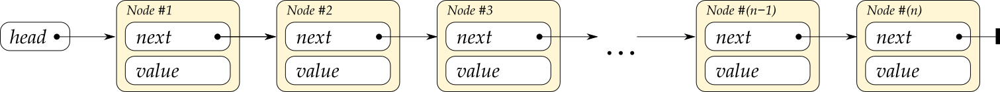
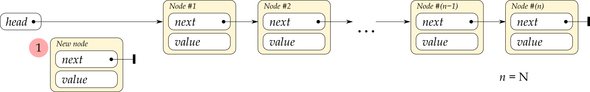
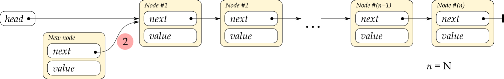
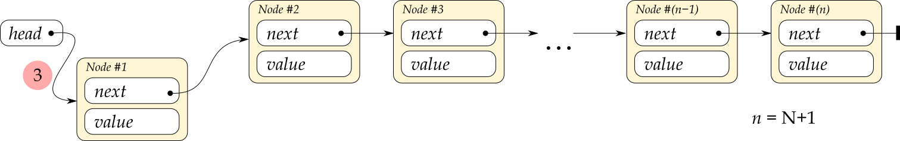

# A biggish C++ linked lists tutorial

*This tutorial is in mid-writing, under construction. The programming language in the examples is C++, not C as indicated by the large Github-added header above. Unfortunately, three suggested ways to get rid of it did not work.*

When you now learn about how to implement linked lists, remember that

* The C++ standard library has two linked list class templates, `std::list` and `std::forward_list` — there’s rarely any need to reinvent those wheels.
* And in most cases a `std::vector` is simpler, safer and more efficient than a linked list, even with a perfect list implementation, so the two mentioned classes are among the least used in the library.
* Do It Yourself™ linked list code is generally complex and error prone, a bug attractor, so a habit of implementing linked lists yourself would be a negative behaviour pattern like  procrastination, overspending, stereotyping, nail-biting and spending too much time watching television or (!) using a computer.

Wikipedia notes about the last point, that

> **”** The best time to correct a bad habit is immediately, before it becomes established. So, bad habits are best prevented from developing in childhood.

Unfortunately correcting the habit of implementing linked lists is difficult to do already in childhood, but one can try to not establish this habit in high school or college.

So why are your teachers insisting that you do this?

It’s mostly about *understanding* things, which is necessary for analysis and for choosing appropriate data structures, and gaining experience in actual *problem solving*, necessary for general software development. Since linked list code is complex, yet with effects that can be stated simply, it’s almost ideal for problem solving exercises. Then there's a little bit of *preparing* you for the possible but unlikely situation where a DIY linked list implementation is needed. As an example: inside an overload of `::operator new` (the global object allocation function in C++), if you should ever need to implement that, you would likely create an incorrect circular chain of calls if you used a list class from the standard library with defaulted template arguments. So, cases where DIY lists are required or convenient do exist, but are rare.

<!-- START doctoc generated TOC please keep comment here to allow auto update -->
<!-- DON'T EDIT THIS SECTION, INSTEAD RE-RUN doctoc TO UPDATE -->
**Table of Contents**  *generated with [DocToc](https://github.com/thlorenz/doctoc)*

- [1. What is a linked list?](#1-what-is-a-linked-list)
- [2. Use of a singly linked list type, `std::forward_list`.](#2-use-of-a-singly-linked-list-type-stdforward_list)
  - [2.1. Iterate with standard iterators.](#21-iterate-with-standard-iterators)
  - [2.2 Do something before the end in an iterator based traversal.](#22-do-something-before-the-end-in-an-iterator-based-traversal)
  - [2.3 Do something before the end in a range based `for` traversal.](#23-do-something-before-the-end-in-a-range-based-for-traversal)
  - [2.4 Insert and remove efficiently at the start of a list.](#24-insert-and-remove-efficiently-at-the-start-of-a-list)
  - [2.5 Reverse a list to get the desired order.](#25-reverse-a-list-to-get-the-desired-order)
  - [2.6 Keep a link to last node to append to a list in constant time.](#26-keep-a-link-to-last-node-to-append-to-a-list-in-constant-time)
  - [2.7. Keep a list sorted by inserting in sorted position.](#27-keep-a-list-sorted-by-inserting-in-sorted-position)
- [3 Basic linked lists with pointers.](#3-basic-linked-lists-with-pointers)
  - [3.1. Make pointers and referents `const` in a good way.](#31-make-pointers-and-referents-const-in-a-good-way)
  - [3.2 Use `new` and `delete` expressions to allocate and deallocate nodes.](#32-use-new-and-delete-expressions-to-allocate-and-deallocate-nodes)
  - [3.3 Define functions to link in and unlink nodes.](#33-define-functions-to-link-in-and-unlink-nodes)
  - [3.4 Keep a pointer to last node to append to a list in constant time.](#34-keep-a-pointer-to-last-node-to-append-to-a-list-in-constant-time)
  - [3.5 Do something before the end in a pointer based traversal (that’s easy).](#35-do-something-before-the-end-in-a-pointer-based-traversal-thats-easy)
  - [3.6 Insert in sorted position in a pointer based list.](#36-insert-in-sorted-position-in-a-pointer-based-list)
- [asdasd](#asdasd)

<!-- END doctoc generated TOC please keep comment here to allow auto update -->

## 1. What is a linked list?

With a **linked list** a sequence of *n* values is represented as a collection of objects where each object carries one of the values + a (common speech, not C++) reference to the object with the next value:

A linked list is the simplest case of a collection of objects that refer to each other. The objects are called **nodes**, and the logical references are **links** between the nodes. In C++ code the links can be pointers or indices or hash values or names, or even pairs of names, whatever serves best to identify the link relation.

For a simplest possible linked list representation such as shown above, the links are stored in the nodes, and because of that there is a link out from the last node even though there is no next node!

This *next* link in the last node is a **null-link**: a special pointer or index or name, whatever, that says “this link doesn’t refer to anything, stop here”. With pointers as links there is a strong convention to use nullpointers, C++ `nullptr`, as null-links. For other link representations there is no established convention.

You can **visit** the nodes in a list like the above in order, also called **traversing** the list, by starting with a link to the first node and just following the *next* links until you encounter the null-link in the last node:

*<small>linked_list_idea.cpp</small>*
~~~cpp
#include <iostream>
#include <map>
#include <string>
using std::cout, std::endl, std::map, std::string;

struct Node
{
    string  name_of_next;
    double  value;
};

auto main()
    -> int
{
    const string    null_link       = "";
    const string    name_of_head    = "pi";

    const map<string, Node> nodes =
    {
        {"pi",          {"e", 3.14 }},      // A node named "pi" that links to node "e".
        {"e",           {"zero", 2.72}},    // ...
        {"zero",        {"the_answer", 0}}, // ...
        {"the_answer",  {"-1", 42}},        // ...
        {"-1",          {null_link, -1}}    // The last node, that just has a null-link.
    };
    
    // Traverse the list & output the values:
    for(    string link = name_of_head;
            link != null_link;
            link = nodes.at( link ).name_of_next ) {
        cout << nodes.at( link ).value << endl;
    }
}
~~~

Result:

~~~txt
3.14
2.72
0
42
-1
~~~

This example uses an unnatural inefficient list representation with name strings as links, and the nodes stored in a `std::map`, to keep things simple. One nice property of names as links is that one can add a node that links to some other node, before that other node exists! With pointers as links a node must exist before it can be linked to, which can complicate things.

---

The term **head** for the first node in a list is standard. A little less clear-cut, the rest of the list is usually called the **tail** of the list. However, one often also speaks about the last single node as the list’s **tail node**, which some people shorten to just “tail”, so there is a possible ambiguity, some room for some misunderstanding.

---

In mathematics one can define a very similar concept in terms of functions. The crucial point of similarity is that one only has direct access to the front of a list, the first node in the list. One can just define a name for the empty list, e.g. *nil*, and a function that constructs a new list from a value *v* and an existing list *rest* (which can be *nil*), e.g. *cons*(*v*, *rest*). Getting at the head of a list is then easy by defining *head*(*cons*(*v*, *rest*)) = *v*. Getting the tail is also easy, math-wise: *tail*(*cons*(*v*, *rest*)) = *rest*.

Another math view of a linked list is as a simplest possible *ordered graph* of *vertices* connected by *edges*.

Programming languages that are based on math concepts like old Lisp (functional) and Prolog (logic programming), and like newer Haskell, Ocaml etc., generally use the head/tail view of lists. And it can be worth also knowing about the terminology employed in Lisp. From the names of processor registers used in machine code level programming on the  IBM 704 computer, in the late 1950s, the *head* function is called `CAR`, short for “contents of the address register”, and the *tail* function is called `CDR`, short for “contents of the decrement register”. The *cons* function is just called `CONS`, short for “construct”.

## 2. Use of a singly linked list type, `std::forward_list`.

I imagine it can be a good idea to learn how to drive a car before sitting down to design a car. Assuming that that’s true, then in the same way it can be a good idea to learn how to use a linked list before sitting down and implementing one’s own linked list. And for that, the simplest linked list in the C++ standard library is `std::forward_list`.

`std::forward_list` is called a “forward” list because it can only be traversed efficiently in one direction, the *forward* direction. That’s because there is only a single, one-way chain of *next* links to follow. This is what’s meant by a **singly linked list**.

The older `std::list` is a two-way linked list, a **doubly linked list**.

### 2.1. Iterate with standard iterators.

The nodes in a `forward_list` are not accessible or even at all visible. C++17 introduced some access to the nodes of associative containers like `std::map`, but not for the lists. And anyway the level of internal links between nodes, that you’d use to iterate through a simple DIY linked list, is not available.

A `forward_list` is instead designed to appear as just an ordinary standard library collection of values. For such a container one uses ordinary **iterators**, essentially small identifier values, to refer to “positions” in the container. Each “position” holds a value, which is all that one has access to.

The iterators are usually obtained from the methods `.begin()` and `.end()`:

*<small>std_forward_list/traversing_a_std_forward_list.with_iterators.cpp</small>*
~~~cpp
#include <forward_list>         // std::forward_list
#include <iostream>
using std::cout, std::endl, std::forward_list;

auto main()
    -> int
{
    const forward_list<double> list = {3.14, 2.72, 0, 42, -1};

    for( auto it = list.begin(); it != list.end(); ++it ) {
        cout << *it << " ";
    }
    cout << endl;
}
~~~

Output:

~~~txt
3.14 2.72 0 42 -1
~~~

Here the call to **`begin`** obtains an iterator that refers to the node (if there is one) that contains the first value in the list, and the call to **`end`** obtains an iterator that works as if it referred to a node after the last one actually in the list. The increment operation `++it` moves the iterator to the next node by following the internal *next*-link in the node, and the **dereferencing** `*it` produces a C++ reference to the value in the node that `it` refers to; the `*` “follows” the iterator into the node it refers to, so to speak. These various parts of the `for` loop code correspond directly to the parts in the earlier named nodes example.

| *In the above iterators-based example:* | *In the earlier named nodes example:* |
|--------------------|------------------------------|
| `auto it = list.begin()` | `string link = name_of_head` |
| `it != list.end()` | `link != null_link` |
| `++it` | `link = nodes.at(link).name_of_next` |

For this particular usage, since the list offers standard `begin` and `end` methods one can alternatively just use a range based `for` loop, which gives shorter and cleaner code:

*<small>std_forward_list/traversing_a_std_forward_list.with_range_based_for.cpp</small>*
~~~cpp
#include <forward_list>         // std::forward_list
#include <iostream>
using std::cout, std::endl, std::forward_list;

auto main()
    -> int
{
    const forward_list<double> list = {3.14, 2.72, 0, 42, -1};

    for( const double v: list ) {
        cout << v << " ";
    }
    cout << endl;
}
~~~

And there are more ways to do this, e.g. using the `std::copy` algorithm to copy to a `std::ostream_iterator`, but to my mind that would be much less clear than the range based `for` loop.

### 2.2 Do something before the end in an iterator based traversal.

Say you want the values in an arbitrary length list presented like this:

~~~txt
3.14, 2.72, 0, 42 and -1.
~~~

In order to output the “and” one must know that one’s traversal is currently at the next to last or last node (or value). This is not a problem with e.g. a `vector`, but `forward_list` is a hardcore minimal implementation of a linked list. It does not waste time and space on keeping a direct link to the last node, or for that matter, on keeping a count of nodes.

So, the only way to know that one is at the end of the list is to check whether the *next* iterator value compares equal to `.end()`. In effect one must look forward in the list 👀, from the current traversal point. Happily the standard library offers the **`std::next`** function that produces the value that `++`-incrementing an iterator variable would have produced:

*<small>std_forward_list/comma_separated_values_of_a_std_forward_list.with_iterators.cpp</small>*
~~~cpp
#include <forward_list>         // std::forward_list
#include <iostream>
#include <iterator>             // std::next
#include <string>               // std::string
using std::cout, std::endl, std::forward_list, std::next;

auto main()
    -> int
{
    const forward_list<double> list = {3.14, 2.72, 0, 42, -1};

    for( auto it = list.begin(); it != list.end(); ++it ) {
        if( it != list.begin() ) {
            // Not at the first node, so add text to separate the previous value.
            const bool is_at_last_node = (next( it ) == list.end());
            cout << (is_at_last_node? " and " : ", ");
        }
        cout << *it;
    }
    cout << "." << endl;
}
~~~

### 2.3 Do something before the end in a range based `for` traversal.

With a range based `for` traversal one doesn’t have an iterator to compare to `.end()`; one only has a reference to a value. And the C++ range based `for` doesn’t offer any mechanism for determining whether the current loop iteration is the last one, which arguably could be useful. In order to do the above “and” example program with a range based `for` one therefore needs some way to know that one is at the end of the list, some other way than checking against `.end()`.

Possibilities include:

* Copy the values to a more convenient container such as a `vector`.
* Generate the output fully or partially in e.g. a `string`, and adjust it after the loop.  
  This is like copying the values, only worse.
* Use a special **sentinel value** (of your choosing) at the end of the list.  
  This is just a possibility for the *general* problem of detecting the list end, e.g. for appending a node. It’s a technique worth knowing about but I see no way that it can help with the problem at hand.
* Let each loop iteration output the *previous* value. Output the very last value after the loop.
* Count the nodes first, and then maintain a running count during the traversal.

The first and second possibilities, copying of values or text, are kludgy and involve inefficient dynamic memory allocation, even if those allocations happen automatically behind the scenes. The third possibility, a sentinel value, is just not helpful for producing the “and” at the right time. The fourth possibility of one-iteration-deferred output is a bit complex, e.g. in the loop one must take care to not output the first value in the first iteration, and more.

So it’s natural to just count the nodes, and the standard library’s `distance` function can do that — since for a pure *forward iterator* it just applies `++` repeatedly to its first iterator until it reaches the second:

*<small>std_forward_list/comma_separated_values_of_a_std_forward_list.with_range_based_for.cpp</small>*
~~~cpp
#include <stddef.h>             // ptrdiff_t
using Size = ptrdiff_t;

#include <forward_list>         // std::forward_list
#include <iostream>
#include <iterator>             // std::distance
#include <string>               // std::string
using std::cout, std::endl, std::forward_list, std::distance;

auto main()
    -> int
{
    const forward_list<double> list = {3.14, 2.72, 0, 42, -1};

    const Size n_nodes = distance( list.begin(), list.end() );
    Size node_number = 0;
    for( const double value: list ) {
        ++node_number;
        if( node_number > 1 ) {
            // Not at the first node, so add text to separate the previous value.
            const bool is_at_last_node = (node_number == n_nodes);
            cout << (is_at_last_node? " and " : ", ");
        }
        cout << value;
    }
    cout << "." << endl;
}
~~~

Output, as before:

~~~txt
3.14, 2.72, 0, 42 and -1.
~~~

This is an example where the range based `for` is less efficient (because one needs to count the number of nodes first) and less convenient, and more verbose!, than using iterators directly. And that’s because it abstracts away the information that one needs, namely the iterator value for the current node. In return for that limitation the loop construct is clean and simple.

### 2.4 Insert and remove efficiently at the start of a list.

With a `vector` one can append an item in (amortized) **constant time** via `push_back`. It’s efficient because there are no items after it that would need to be moved in the vector’s internal array. Conversely, straightforward insertion at the front of a `vector` takes time roughly proportional to number of items in the vector, **linear time**, because they all need to be moved.

In **big Oh** notation constant time and linear time is denoted by respectively **O(1)** and **O(*n*)**, where for vector insertion *n* is the number of items.

A `forward_list` has the opposite big Oh behavior of `vector`, or of an array in general. Insertion at the front, e.g. via `push_front`, is O(1), because it just involves a couple of adjustments of internal links, “linking in” the new node. Straightforward insertion at the end is O(*n*), because it involves traversing the whole list in order to *find* the end…

For both `vector` and `forward_list` one can do things in less straightforward ways so as to get O(1) insertion also at the other end. For `vector` it involves a technique called “cursor gap”, and for `forward_list` it involves maintaining an iterator to the last node. In both cases this reduces other functionality and adds complexity that is best wrapped up in a class.

Anyway, corresponding to the efficient O(1) list insertion via `push_front` you can remove the first node in constant time via `pop_front`, and you can inspect the first value via just `front`:

*<small>std_forward_list/insert_and_remove_numbers.cpp</small>*
~~~cpp
#include <forward_list>
#include <iostream>
using std::forward_list, std::cout, std::endl;

auto main()
    -> int
{
    forward_list<int> list;
    cout << "Inserting..." << endl;
    for( int i = 1; i <= 12; ++i ) {
        list.push_front( i );
        cout << i << " ";
    }
    cout << endl;

    cout << endl;
    cout << "Removing..." << endl;
    while( not list.empty() ) {
        cout << list.front() << " ";
        list.pop_front();
    }
    cout << endl;
}
~~~

Output:

~~~txt
Inserting...
1 2 3 4 5 6 7 8 9 10 11 12

Removing...
12 11 10 9 8 7 6 5 4 3 2 1
~~~

The values **pop** out of the list in the opposite order that they were **push**ed onto the list. In other words, the first value into the list, here `1`, is the last value out. This is called **LIFO** (last in first out) behavior, or **stack** behavior, because it’s similar to how the last dinner plate placed on a stack of dinner plates, the one on top, is the first one to be removed. The terms “push” and “pop” refer to how one deals with a spring-loaded such stack, a *pushdown stack*, in a restaurant kitchen.

However, this close correspondence & big Oh efficiency doesn’t mean that a `forward_list` should be your first choice for an implementation of a stack. Use a `std::stack` instead. Or maybe a `std::vector`, for ease of inspecting the values in the stack. With a `vector` you just use `push_back` and `pop_back` instead of the list’s `push_front` and `pop_front`. And since a `vector` plays well with modern machine’s caching strategies it’s generally more efficient than the list.

### 2.5 Reverse a list to get the desired order.

The LIFO behavior of the efficient insert and remove operations like `push_front` and `pop_front`, means that it’s easy to reverse a list. Just pop all its nodes and push them onto another list, and when all is done, `move`-assign the result list back in O(1) time. However you don’t have to implement that, because there’s the `.reverse()` convenience method that does it for you, and it does it without any copying of values.

To avoid copying of values in your own implementation you’d have to use `.splice_after()` to move nodes, instead of `pop_front` and `push_front`.

For an example where a reversal is practically needed, consider generating a Collatz sequence of integers in a `forward_list`. If a number *x* is even then the next Collatz sequence number is *x*/2, and if it’s odd then the next Collatz sequence number is 3*x* + 1. The **Collatz conjecture** is that no matter which positive integer you start with, if you follow this system then you’ll always eventually end up at 1, and that’s so well tested and likely true that it can just be assumed:

*<small>std_forward_list/collatz.list.iterative.cpp</small>*
~~~cpp
#include <assert.h>         // assert
#include <stdlib.h>         // EXIT_...

#include <forward_list>     // std::forward_list
#include <iostream>
#include <string>           // std::stoi
using std::forward_list, std::cout, std::cerr, std::endl, std::stoi;

auto is_even( const int x )
    -> bool
{ return x % 2 == 0; }

auto reversed_collatz_sequence( int x )
    -> forward_list<int>
{
    forward_list<int> result;
    for( ;; ) {
        result.push_front( x );
        if( x == 1 ) {
            return result;
        }
        x = (is_even( x )? x/2 : 3*x + 1);
    }
}

auto collatz_sequence( const int x )
    -> forward_list<int>
{
    forward_list<int> result = reversed_collatz_sequence( x );
    result.reverse();                       // Ta da! Correction!
    return result;
}

auto main( int n_command_parts, char** command_parts )
    -> int
{
    if( n_command_parts != 2 ) {
        cerr << "!Usage: " << command_parts[0] << " STARTING_NUMBER" << endl;
        return EXIT_FAILURE;
    }
    const int starting_number = stoi( command_parts[1] );
    assert( starting_number >= 1 );

    for( const int v: collatz_sequence( starting_number ) ) {
        if( v != starting_number ) {        // We trust mr. Collatz.
            cout << " -> ";
        }
        cout << v;
    }
    cout << "." << endl;
}
~~~

Example building and output (this is in Cmd in Windows 10):

~~~txt
[X:\linked lists (for github)\source\std_forward_list]
> g++64 collatz.list.iterative.cpp

[X:\linked lists (for github)\source\std_forward_list]
> a
!Usage: a STARTING_NUMBER

[X:\linked lists (for github)\source\std_forward_list]
> for /L %c in (1, 1, 11) do @a %c
1.
2 -> 1.
3 -> 10 -> 5 -> 16 -> 8 -> 4 -> 2 -> 1.
4 -> 2 -> 1.
5 -> 16 -> 8 -> 4 -> 2 -> 1.
6 -> 3 -> 10 -> 5 -> 16 -> 8 -> 4 -> 2 -> 1.
7 -> 22 -> 11 -> 34 -> 17 -> 52 -> 26 -> 13 -> 40 -> 20 -> 10 -> 5 -> 16 -> 8 -> 4 -> 2 -> 1.
8 -> 4 -> 2 -> 1.
9 -> 28 -> 14 -> 7 -> 22 -> 11 -> 34 -> 17 -> 52 -> 26 -> 13 -> 40 -> 20 -> 10 -> 5 -> 16 -> 8 -> 4 -> 2 -> 1.
10 -> 5 -> 16 -> 8 -> 4 -> 2 -> 1.
11 -> 34 -> 17 -> 52 -> 26 -> 13 -> 40 -> 20 -> 10 -> 5 -> 16 -> 8 -> 4 -> 2 -> 1.
~~~

Doing this with a `vector` is simpler because it doesn’t need to be reversed, and it’s also likely more efficient. I find it almost impossibly hard to come up with an example where a `forward_list` would be a good choice in practical programming. As a means to learn about use of linked lists before implementing them, it is however very nice indeed.

### 2.6 Keep a link to last node to append to a list in constant time.

An alternative to reversing is to just add the values in the right order in the first place. For the Collatz sequence that means *appending* values to the end of the list. In order to do that with reasonable efficiency, namely O(1), one needs to keep an iterator to the last node and use the `.insert_after()` method.

For an empty list there is no last node yet, so in general, e.g. for your own DIY linked list implementation, this must be handled as a special case. However, `forward_list` offers the method `.before_begin()` which produces an iterator that works *as if* it refers to a node before the first one, a pseudo-node that pseudo-exists also for an empty list. With that one can just initialize the iterator to last node, to the one from `.before_begin()`.

The code now approaches — though it doesn’t quite reach — the simplicity of expressing this with `vector`:

*<small>std_forward_list/collatz.list.iterative_appending.cpp</small>*
~~~cpp
#include <assert.h>         // assert
#include <stdlib.h>         // EXIT_...

#include <forward_list>     // std::forward_list
#include <iostream>
#include <string>           // std::stoi
using std::forward_list, std::cout, std::cerr, std::endl, std::stoi;

auto is_even( const int x )
    -> bool
{ return x % 2 == 0; }

auto collatz_sequence( int x )
    -> forward_list<int>
{
    using Iterator = forward_list<int>::iterator;

    forward_list<int> result;
    Iterator          it_lastnode = result.before_begin();
    for( ;; ) {
        it_lastnode = result.insert_after( it_lastnode, x );        // Append.
        if( x == 1 ) {
            return result;
        }
        x = (is_even( x )? x/2 : 3*x + 1);
    }
}

auto main( int n_command_parts, char** command_parts )
    -> int
{
    if( n_command_parts != 2 ) {
        cerr << "!Usage: " << command_parts[0] << " STARTING_NUMBER" << endl;
        return EXIT_FAILURE;
    }
    const int starting_number = stoi( command_parts[1] );
    assert( starting_number >= 1 );

    for( const int v: collatz_sequence( starting_number ) ) {
        if( v != starting_number ) {        // We trust mr. Collatz.
            cout << " -> ";
        }
        cout << v;
    }
    cout << "." << endl;
}
~~~

Output as before.

Note that the iterator to last node is updated for every append. Otherwise after the first append it would be an iterator to the next to last node, and after that things would go haywire. The pattern `it = some_func( it, ... )` is very common.

### 2.7. Keep a list sorted by inserting in sorted position.

Inserting a value in a sorted position in a list has the problem that with a simple-minded search one doesn’t know that one has found the sorted position until one is one node past it… 

~~~cpp
using Iterator = forward_list<double>::iterator;

auto sorted_insert_position_for( const double value, forward_list<double>& list )
    -> Iterator
{
    for(    Iterator it = list.begin();
            it != list.end();
            ++it ) {
        if( *it >= value ) {
            // Dang, already one node too far! And can't go back. So, bye bye...
            terminate();
        }
    }
    // Double dang, again the search has overshot the desired location. Well.
    terminate();
}
~~~

A common solution is to use a link that lags one step behind the link used for the traversal. With pointers as links this is known as a **trailing pointer**, and I guess with a `forward_list` one can talk about a trailing iterator, and generally about a trailing link. Then when the one-node-too-far is found, the trailing iterator at this point correctly refers to the node whose internal *next* link should be adjusted to now refer to the new node.

~~~cpp
auto sorted_insert_position_for( const double value, forward_list<double>& list )
    -> Iterator
{
    Iterator trailing = list.before_begin();
    for(    Iterator it = list.begin();
            it != list.end() and *it < value;
            ++it ) {
        trailing = it;
    }
    return trailing;
}
~~~

Without a trailing link, as with the example of detecting the end of the list one must then effectively look forward in the list 👀. But unlike with detection of the end one must now also look *into* the next node, to check the value there. And this adds a further complication, an extra check, because at the end of the list there just is no next node to look into: trying to look into that non-existing node would yield Undefined Behavior.

~~~cpp
auto sorted_insert_position_for( const double value, forward_list<double>& list )
    -> Iterator
{
    Iterator it_next_node;
    for(    Iterator it = list.before_begin();
            ;
            it = it_next_node ) {
        it_next_node = next( it );
        if( it_next_node == list.end() or *it_next_node >= value ) {
            return it;
        }
    }
    // Execution will never reach this point.
}
~~~

The above implementation depends on the short-circuit behavior of the built-in C++ `or`, that the second operand is not evaluated if the first operand is `true`. More generally for both built-in `or` and `and`, the second operand isn’t evaluated if the first operand already determines the value of the expression, assuming that both operands would have produced some `bool` value. I.e., the assumption is that there is no program exit or hang in the evaluation of the second operand.

A complete program using the trailing link technique:

*<small>std_forward_list/insert_sorted.using_trailing_link.cpp</small>*
~~~cpp
#include <forward_list>         // std::forward_list
#include <initializer_list>     // Required for deduced type of brace initializer.
#include <iostream>
using std::cout, std::endl, std::forward_list;

using Iterator = forward_list<double>::iterator;

auto sorted_insert_position_for( const double value, forward_list<double>& list )
    -> Iterator
{
    Iterator trailing = list.before_begin();
    for(    Iterator it = list.begin();
            it != list.end() and *it < value;
            ++it ) {
        trailing = it;
    }
    return trailing;
}

auto main()
    -> int
{
    const auto data = {3.14, 2.72, 0., 42., -1.};
    forward_list<double> list;

    for( const double v: data ) {
        const Iterator insert_position = sorted_insert_position_for( v, list );
        list.insert_after( insert_position, v );
    }

    for( const double v: list ) {
        cout << v << " ";
    }
    cout << endl;
}
~~~

Output:

-1 0 2.72 3.14 42

For large data sets this is not a good idea since the time to insert a new value/item is proportional to the number of values/items that you already have, O(*n*), linear time. And if you use repeated sorted insertions to sort an entire existing list then you have O(*n*²), **quadratic time**. I discovered in high school, for a Basic program I made to keep track of radio amateur QSL cards, that quadratic time sorting *really* slows down things as the number of items increases. I’d used much time on developing this program that now turned out to be practically unusable, and there was also some prestige in it (I’d made it to help the radio amateurs at the school), so it was a lesson that stuck. If you need to sort a `forward_list` then use its `.sort()` method, and for your own DIY linked list use a merge sort.

Well, of course, if you have a sorted list and a new item, then O(*n*) inserting is preferable to O(*n* log *n*) full sorting.

There are an almost unbounded number of further linked list topics that could be discussed with `forward_list` examples. We haven’t even explored a majority of the `forward_list` methods, much less what they can be used for, and how. But with this it’s now time to get down to the nitty gritty of implementing your own linked list, which after all is what teachers tend to require students to do, and which probably is why you’re reading this.

## 3 Basic linked lists with pointers.

A C++ **pointer** is a memory address with some nice operations:

|*Operation:* | *Name:* | *Result:* |
|----------|------|--------|
| `&thing` | Address operator. | The address of `thing`, i.e. a pointer that refers to `thing`. There are more ways to obtain pointers. This is the basic way. |
| `*p` | Dereferencing. | Denotes the `thing` that `p` refers to when `p` is the value `&thing`. |
| `p->m` | — | Equivalent to `(*p).m`, but is often a more clear notation. |
| `p + 1`  | Increment. | If `p` refers to an array item, then `p + 1` refers to the next array item.
| `not p` | Implicit conversion to `bool`. | `not p` is the same as `p == nullptr`. Using `not` is just one example of a context where a `bool` is expected, causing an implicit conversion to `bool` of the pointer. In particular one may write just `if(p){`… |

The type of a pointer that refers to an `int` object is `int*`. More generally the type of a pointer that refers to an object of a type `T` is **`T*`**. And, crucially for use of pointers as links in nodes, because the size of a pointer itself is known to the compiler you can use the type `T*` even before `T` has been fully defined, at a point where `sizeof(T)` is not yet known:

*<small>pointer_list/concrete_pointer_list.cpp</small>*
~~~cpp
#include <iostream>
using std::cout, std::endl;

struct Node
{
    Node*   pointer_to_next;
    double  value;
};

auto main()
    -> int
{
    Node    minus1      = { nullptr, -1 };
    Node    the_answer  = { &minus1, 42 };
    Node    zero        = { &the_answer, 0 };
    Node    e           = { &zero, 2.72 };
    Node    pi          = { &e, 3.14 };
    
    Node* pointer_to_head = &pi;

    // Traverse the list & output the values:
    for(    Node* p = pointer_to_head;
            p != nullptr;
            p = p->pointer_to_next ) {
        cout << p->value << endl;
    }
}
~~~
 
 Output, as with the first name string based linked list example:

~~~txt
3.14
2.72
0
42
-1
~~~

### 3.1. Make pointers and referents `const` in a good way.

`const` introduces a constraint, fewer ways that values can change, so that it becomes easier to understand the code.

There is a cost: verbosity. But generally the consensus is that sprinkling `const` as liberally as possible throughout the code, is a Good Thing&trade;. The time lost to having to type and read a little bit more source code is generally more than paid for by time saved on not tracking down weird bugs and generally on not having to try very hard to understand the code.

The language’s basic systematic `const` notation is that a `const` is placed *to the right* of what it refers to. Naturally this is called **east `const`** notation (heads-up: it’s not my preferred notation). Applied to the concrete linked list example it can go like this:

*<small>pointer_list/concrete_pointer_list.east_const.cpp</small>*
~~~cpp
#include <iostream>
using std::cout, std::endl;

struct Node
{
    Node const* pointer_to_next;
    double      value;
};

auto main()
    -> int
{
    Node const  minus1      = { nullptr, -1 };
    Node const  the_answer  = { &minus1, 42 };
    Node const  zero        = { &the_answer, 0 };
    Node const  e           = { &zero, 2.72 };
    Node const  pi          = { &e, 3.14 };
    
    Node const* const pointer_to_head = &pi;

    // Traverse the list & output the values:
    for(    Node const* p = pointer_to_head;
            p != nullptr;
            p = p->pointer_to_next ) {
        cout << p->value << endl;
    }
}
~~~

---

There is a problem here.

With a `const` node such as `minus1`, taking the address as is done in the initializer for the immediately following `the_answer` node yields a `Node const*` pointer value, a pointer to `Node const`. This pointer value cannot be assigned to (or used to initialize) a `Node*` data member, because that would give a way to modify the referent, which was declared `const` to express a guarantee that it would not be modified. And so to be compatible with the pointer values one gets from taking the addresses of `const` node objects, the `Node::pointer_to_next` data member had to be declared as type `Node const*`.

But this means that when one traverses a list of such nodes, even nodes that were not originally `const`, all that one will get will be pointers to `Node const`. And those pointers can’t be used to modify the `value` in a node (or for that matter, adjusting the `pointer_to_next`). So, with reasonable direct use of pointers, without jumping through a kilometersize tangle of hoops, a given `Node` definition supports originally `const` nodes, or originally mutable nodes, but not both.

In practice one therefore chooses to let the node type support mutable nodes, i.e. that *next* pointer will be of type `Node*`, and address `const`-ness at ***some higher level of abstraction***. For example, a `forward_list` can be `const` and still usable. Internally in that list the nodes that one doesn't see but can infer must exist, are probably like nodes with `Node*` *next*-pointers.

With a higher level abstraction like that it’s important to not let access to nodes and their *next* pointers escape out, otherwise one risks that some code will use that access to modify an originally `const` object, which is Undefined Behavior:

*<small>pointer_list/concrete_pointer_list.east_const.ub_with_mutable_nodes.cpp</small>*
~~~cpp
#include <iostream>
using std::cout, std::endl;

struct Node
{
    Node*       pointer_to_next;
    double      value;
};

auto main()
    -> int
{
    struct List
    {
        Node minus1      = { nullptr, -1 };
        Node the_answer  = { &minus1, 42 };
        Node zero        = { &the_answer, 0 };
        Node e           = { &zero, 2.72 };
        Node pi          = { &e, 3.14 };
        
        auto pointer_to_head() const
            -> Node const*
        { return &pi; }
    };
    
    List const list = {};

    // Traverse the list & output the values:
    for(    Node const* p = list.pointer_to_head();
            p != nullptr;
            p = p->pointer_to_next ) {
        cout << p->value << endl;
    }
    
    Node* const pointer_to_e = list.pi.pointer_to_next;
    pointer_to_e->value = 6.28;     // Oops, UB for modifying originally `const` object.
    cout << endl;
    cout << "The value of e is " << list.e.value << ", possibly." << endl;
}
~~~

Both compilers I tried this with, Visual C++ 2019 and MinGW g++ 9.2, produced the following output:

~~~txt
3.14
2.72
0
42
-1

The value of e is 6.28, possibly.
~~~

But there’s just no guarantee. If the compiler is smart in the wrong way it may note that it “knows” that `list.e.value` is `2.72`, because after all `list` is an originally `const` object that can’t change, and then as an optimization it might use that value in the final output statement. Or, it might note that there is UB and optimize away all effects of the program, say.

Just to summarize the problem:

* At initialization time for the `list` a pointer to non-`const`, namely a `Node*` pointer, was initialized to point to an at that time mutable object, namely `list.e`.
* The pointer was allowed to be accessible from outside the abstraction `List`: it escaped out!
* It was then used to modify the now originally (after initialization) `const` object, causing Undefined Behavior.

Possible solutions, ways to completely hide the nodes and their *next* pointers while giving access to the values, include

* The abstraction can provide iterators, like `forward_list` does.
* The abstraction can provide an internal iteration state.
* The abstraction can provide a way to call a specified function for each value.

Iterators are not very complex but they involve much boilerplate code, and in order to conform to the requirements on standard iterators one must get a lot of details right. An internal iteration state can be simple but it precludes having a `const` object, which throws out the baby with the bath water. So, below is one way to have a specified function called for each value in the list:

*<small>pointer_listconcrete_pointer_list.east_const.mutable_nodes_hidden_via_callback.cpp</small>*
~~~cpp
#include <iostream>
using std::cout, std::endl;

struct Node
{
    Node*       pointer_to_next;
    double      value;
};

class List
{
    Node minus1      = { nullptr, -1 };
    Node the_answer  = { &minus1, 42 };
    Node zero        = { &the_answer, 0 };
    Node e           = { &zero, 2.72 };
    Node pi          = { &e, 3.14 };
    
public:
    template< class Func >
    void for_each_value( Func const& f ) const
    {
        for( Node const* p = &pi; p != nullptr; p = p->pointer_to_next ) {
            f( p->value );
        }
    }
};

auto main()
    -> int
{
    List const list = {};

    // Traverse the list & output the values:
    list.for_each_value( [&](double v){ cout << v << endl; } );
}
~~~

Here the construct

    [&](double v){ cout << v << endl; }

… is a **lambda expression**, a way to define a function locally within an expression in the code. The `&` in the lambda designator `[&]` says that this lambda references things outside itself, namely `cout` and `endl`, and we say that it **captures** those things by reference. This is a **callback** function since it's “called back” by the `List::for_each_value` function. The list is like, “don’t call me, I’ll call you”. Instead of the lambda I could have defined an ordinary named function to use as callback.

There is no way here for the `List`-using code to modify the `const` object.

For example, if the lambda is changed to take a reference-to-non-`const` argument,

    [&](double& v){ v = 6.28; }

… then the `for_each_value` code simply doesn’t compile, so it’s a safe technique.

---

My preferred notation is **west `const`**, with the `const` always to the left of what it refers to.

This notation is possible because C++ supports it for the leftmost type in a declaration, *as a special case*. For example, the declaration `char const* p;` can be written as `const char* p;`. Similarly, `Node const* p` in the above code can be written as `const Node* p`.

You can’t rewrite something like `char const* const s = "Hi!";`  as a west `const` declaration like `const (const char*) s = "Hi!";`, because C++ doesn’t support parentheses in type expressions. The only built-in support for general substitution in type expressions is to name the parts with `typedef` or `using`. But to be able to use west `const` for any declaration without naming parts of the declaration, you can define a single line of support,

~~~cpp
template< class T > using Type_ = T;
~~~

… where then `Type_<`*some-type-expression*`>` is the same as, if C++ had allowed parentheses, `(`*some-type-expression*`)`.

For example, something like `char const* const s = "Hi!";` can then be written in west `const` style as `const Type_<const char*> s = "Hi!";`. And as an added bonus declarations where the language’s special case rule allows west `const` already, like the declaration `const Node* p`, can then be written like `Type_<const Node>* p` where it’s slightly more clear that `p` itself isn’t `const` (because the `*` more clearly applies to the whole `Type_<const Node>`). However, I generally don’t do that because to people who generally use west `const`, type expressions like `const Node*` are clear enough already — much like the meaning of `double` as a floating point number is clear to those who are *familiar* with it.

As far as I know the `Type_` support, modulo the name, was first proposed by Johannes “litb” Schaub.

The type substitution support is not technically required to express this section’s example program with west `const`, but applying it for clarity it can go like this:

*<small>Type_.hpp</small>*
~~~cpp
#pragma once
template< class T > using Type_ = T;
~~~

*<small>pointer_list/concrete_pointer_list.west_const.mutable_nodes_hidden_via_callback.cpp</small>*
~~~cpp
#include "../Type_.hpp"

#include <iostream>
using std::cout, std::endl;

struct Node
{
    Node*       pointer_to_next;
    double      value;
};

class List
{
    Node minus1      = { nullptr, -1 };
    Node the_answer  = { &minus1, 42 };
    Node zero        = { &the_answer, 0 };
    Node e           = { &zero, 2.72 };
    Node pi          = { &e, 3.14 };
    
public:
    template< class Func >
    void for_each_value( const Func& f ) const
    {
        for( Type_<const Node>* p = &pi; p != nullptr; p = p->pointer_to_next ) {
            f( p->value );
        }
    }
};

auto main()
    -> int
{
    const List list = {};

    // Traverse the list & output the values:
    list.for_each_value( [&](double v){ cout << v << endl; } );
}
~~~

### 3.2 Use `new` and `delete` expressions to allocate and deallocate nodes.

With a successful **dynamic allocation** you get a pointer to a new object somewhere in memory. That object will persist even if the code manages to forget the pointer, and after function returns, which makes it ideal as a node in a linked list. To avoid such objects accumulating and using up all available memory they should be **deallocated** when they’re no longer needed, in a way that corresponds to the dynamic allocation.

---

In C++ dynamic allocation is strongly tied to initialization, via a **`new`-expression** that allocates memory and calls a specified constructor to create an object of your specified type *T*, in the allocated memory chunk. Conversely, deallocation is strongly tied to cleanup, via a **`delete`-expression** that calls the object’s *T* destructor and deallocates the memory. In the possible case where the object’s constructor signals failure by throwing an exception the `new`-expression temporarily catches the exception, calls destructors on all successfully initialized sub-objects (since the top level object is not successfully initialized its *T* destructor, which tends to assume that, is not called), deallocates the memory, and re-throws the exception — so that you get an **all-or-nothing** effect where either you get a new successfully initialized object, or else you just get an exception.

Example showing that an object dynamically allocated by one function can be deallocated in another function:

*<small>pointer_list/new_and_delete.cpp</small>*
~~~cpp
#include "../Type_.hpp"

#include <iostream>
using std::clog, std::endl;

void trace( const Type_<const char*> s ) { clog << s << endl; }

struct Noisy_object
{
    Noisy_object()
    {
        trace( "--> Object created." );
    }
    
    ~Noisy_object()
    {
        trace( "--> Object destroyed." );
    }
};

auto foo()
    -> Noisy_object*
{
    trace( "In function `foo`, executing a `new`-expression." );
    return new Noisy_object;
}

void bar( const Type_<Noisy_object*> p )
{
    trace( "In function `bar`, executing a `delete`-expression." );
    delete p;
}

auto main()
    -> int
{
    trace( "In `main`." );

    const Type_<Noisy_object*> p = foo();
    trace( "Back in `main` again." );

    bar( p );
    trace( "Back in `main` again." );
    trace( "Finished! :)" );
}
~~~

Output:

~~~txt
In `main`.
In function `foo`, executing a `new`-expression.
--> Object created.
Back in `main` again.
In function `bar`, executing a `delete`-expression.
--> Object destroyed.
Back in `main` again.
Finished! :)
~~~

---

Direct use of `new` and `delete` expressions like above, is necessary for implementing linked data structures like linked lists. But it’s extraordinarily easy to get this wrong. For example, it’s easy to inadvertently `delete` the same object twice, which is UB, or to forget to `delete` it, which then causes a **memory leak**.

Therefore, for purposes other than linked data structures, first and foremost consider safe standard library containers like `std::vector`.

And if the containers don’t cut it, consider pointer wrapper classes such as the standard library’s `std::unique_ptr` and `std::smart_ptr`, which *automate* the deallocations. These are called **smart pointers**. They’re not very smart at all, but because of the automation they are generally much safer than the core language’s **raw pointers** used above.

| *Rank*: | *Kind of solution:* |
|---------|---------------------|
| Best and safest. | Standard library containers like `std::vector` and `std::string`. |
| So so. | Smart pointers like `std::unique_ptr` and `std::shared_ptr`. |
| Risky, dubious code. | Raw pointers and `new` and `delete` expressions. |

Except, importantly: *don't* use smart pointers as links in linked data structures.

Because if you do then you risk automated recursive destructor calls all the way through the data structure, which can easily cause UB via a **stack overflow**, which you absolutely don’t want.

### 3.3 Define functions to link in and unlink nodes.

A nice thing about dynamic allocation is that the individual objects don’t need corresponding top level named pointer variables. For example, with a linked list one only needs a pointer variable that designates the head node. The other nodes are found by following the *next* pointers in the nodes.

Adding a new node at the start of the list then consists of just

1. Allocate & initialize the node.  

2. Set its *next* pointer to point to the current head node.  

3. Set the head node pointer to point to the new node.  

Removing the head node is just opposite, so:

*<small>pointer_list/insert_and_remove_numbers.in_pointer_list.cpp</small>*
~~~cpp
#include "../Type_.hpp"

#include <iostream>
using std::cout, std::endl;

struct Node
{
    Node*   next;
    int     value;
};

auto main()
    -> int
{
    Node* head = nullptr;
    cout << "Inserting..." << endl;
    for( int i = 1; i <= 12; ++i ) {
        const Type_<Node*> new_node = new Node{ nullptr, i };
        new_node->next = head;
        head = new_node;
        cout << i << " ";
    }
    cout << endl;

    cout << endl;
    cout << "Removing..." << endl;
    while( head != nullptr ) {
        cout << head->value << " ";
        const Type_<Node*> doomed_node = head;
        head = head->next;
        delete doomed_node;
    }
    cout << endl;
}
~~~

Output:

~~~txt
Inserting...
1 2 3 4 5 6 7 8 9 10 11 12

Removing...
12 11 10 9 8 7 6 5 4 3 2 1
~~~

---

As a matter of C++ coding, the two first statements in

~~~cpp
    const Type_<Node*> new_node = new Node{ nullptr, i };
    new_node->next = head;
    head = new_node;
~~~

… can be reduced to a single statement, as in

~~~cpp
    const Type_<Node*> new_node = new Node{ head, i };
    head = new_node;
~~~

… and here the `new_node` variable serves no purpose, so this can in turn be reduced to just

~~~cpp
    head = new Node{ head, i };
~~~

So, that’s the basic insert-a-new-node-at-the-start-of-the-list code. It’s short enough that one may tend to just write it directly wherever it’s needed. Hopefully the experienced C++ programmers that read this won’t have experienced a heart attack or something before getting to this point of more natural short code instead of pedagogical 1, 2, 3 code.

---

Even though the insertion code snippet is very short, as far as I know the corresponding code for node removal can’t be reduced that way.

So, for the teaching examples I prefer (and also if I had occasion to *actually* implement a linked list I would prefer) to define functions for insertion and removal. These functions operate on the *next* fields, and they’re only concerned with **linking** and **unlinking**, the links manipulation. Where a node to link in comes from, e.g. from a `new`-expression or another list, and what will happen to an unlinked node, e.g. destroyed or moved to another list, is of no concern to these functions.

Ideally, to prevent these functions from being inadvertently applied to pointer variables other than *next* fields and *head* pointers, the *next* fields and *head* pointer should be a distinct type, some kind of trivial pointer wrapper. Counting against that idea is the fact that I’ve never inadvertently misapplied the functions, so at least for me there would be no significant advantage; a case of [YAGNI](https://en.wikipedia.org/wiki/You_aren%27t_gonna_need_it). Plus the distinct type would be more code and abstraction, i.e. less simple and clear, so:

*<small>pointer_list/link_and_unlink_functions.cpp</small>*
~~~cpp
#include <iostream>
using std::cout, std::endl;

struct Node
{
    Node*   next;
    int     value;

    void link_in_before( Node*& a_next_field )
    {
        next = a_next_field;
        a_next_field = this;
    }
    
    friend auto unlinked( Node*& a_next_field )
        -> Node*
    {
        const auto result = a_next_field;
        a_next_field = result->next;
        return result;
    }
};

auto main()
    -> int
{
    Node* head = nullptr;
    cout << "Inserting..." << endl;
    for( int i = 1; i <= 12; ++i ) {
        (new Node{ nullptr, i })->link_in_before( head );
        cout << i << " ";
    }
    cout << endl;

    cout << endl;
    cout << "Removing..." << endl;
    while( head != nullptr ) {
        cout << head->value << " ";
        delete unlinked( head );
    }
    cout << endl;
}
~~~

Output, as before:

~~~txt
Inserting...
1 2 3 4 5 6 7 8 9 10 11 12

Removing...
12 11 10 9 8 7 6 5 4 3 2 1
~~~

The naming here may at first seem odd, `link_in_before` versus (which does just about the same) `forward_list::insert_after`. That's because `insert_after` reads as inserting *after* a specified node, while `link_in_before` reads as linking a new node in *before* the node that a specified *next* field points to. The naming is all about how the calling code reads, and e.g. the call in this program, `link_in_before(head)`, is self-explanatory.

### 3.4 Keep a pointer to last node to append to a list in constant time.

As with the `forward_list`, to append in a reasonably efficient way, namely O(1) time, you can keep a link to the last node.

With a pointer based list that link is naturally a pointer.

For a list abstraction one may choose to maintain a last node pointer along with the node list. `forward_list` doesn’t, because it’s easy to add on top but impossible to remove, and also because it would constrain the operation set. Without any abstraction one will typically just temporarily maintain a last node pointer during a sequence of append operations.

*<small>pointer_list/Node.hpp</small>*
~~~cpp
#pragma once

struct Node
{
    Node*   next;
    double  value;

    void link_in_before( Node*& a_next_field )
    {
        next = a_next_field;
        a_next_field = this;
    }
    
    friend auto unlinked( Node*& a_next_field )
        -> Node*
    {
        const auto result = a_next_field;
        a_next_field = result->next;
        return result;
    }
    
    friend void delete_list( Node* head )
    {
        while( head != nullptr ) {
            delete unlinked( head );
        }
    }
};
~~~

*<small>pointer_list/list_copy_of_the_five_important_numbers.hpp</small>*
~~~cpp
#pragma once
#include "Node.hpp"
#include "../Type_.hpp"
#include <initializer_list>         // Required for deduced type of brace initializer.

inline auto list_copy_of_the_five_important_numbers()
    -> Node*
{
    Node*   head    = nullptr;
    Node*   last    = nullptr;
    for( const double v: {3.14, 2.72, 0., 42., -1.} ) {
        const Type_<Node*> new_node = new Node{ nullptr, v };
        if( head == nullptr ) {
            head = new_node;
        } else {
            new_node->link_in_before( last->next );
        }
        last = new_node;
    }
    return head;
}
~~~

*<small>pointer_list/five_numbers_as_pointer_list.cpp</small>*
~~~cpp
#include "list_copy_of_the_five_important_numbers.hpp"

#include <iostream>
using std::cout, std::endl;

auto main()
    -> int
{
    const Type_<Node*> head = list_copy_of_the_five_important_numbers();

    for( Node* p = head; p != nullptr; p = p->next ) {
        cout << p->value << endl;
    }

    delete_list( head );
}
~~~

Output:

~~~txt
3.14
2.72
0
42
-1
~~~

In this program for an ordinary desktop system or better it’s not technically necessary to `delete` all the nodes at the end. The operating system, e.g. Mac OS, Linux or Windows, will reclaim the memory automatically when the process terminates. It will also close any open file handles and will in general do a fair general clean-up, and as long as that automatic clean-up covers what the program needs clean-up for (e.g. it doesn't cover removing temporary files) one can technically just rely on it.

However, when you debug a program or run some other diagnostic tool such as Valgrind, the tool may complain about memory leaks if the program doesn’t itself clean up everything.

And then you might waste time chasing a non-existing bug, so, better clean up; hence the `delete_list` function here.

### 3.5 Do something before the end in a pointer based traversal (that’s easy).

From the `forward_list` discussion recall the “do something before the end” problem of presenting output like

~~~txt
3.14, 2.72, 0, 42 and -1.
~~~

With iterators that give access only to the values, detecting the end of the list to output that “and” was difficult. To make that logic reasonably simple we had to use the iterator-to-pseudo-node `.before_begin()`. This supported no-special-case code that looked forward in the list 👀.

But with pointers to nodes the last node’s *next* pointer can be seen and is a `nullptr`, so it’s easy to detect the last node *without looking forward*:

*<small>pointer_list/comma_separated_values_of_a_pointer_list.cpp</small>*
~~~cpp
#include "list_copy_of_the_five_important_numbers.hpp"

#include <iostream>
using std::cout, std::endl;

auto main()
    -> int
{
    const Type_<Node*> head = list_copy_of_the_five_important_numbers();

    for( Node* p = head; p != nullptr; p = p->next ) {
        if( p != head ) {
            // Not at the first node, so add text to separate the previous value.
            const bool is_at_last_node = (p->next == nullptr);
            cout << (is_at_last_node? " and " : ", ");
        }
        cout << p->value;
    }
    cout << "." << endl;

    delete_list( head );
}
~~~

### 3.6 Insert in sorted position in a pointer based list.

For `std::forward_list` it was easy to choose a return type for the function to find a sorted insertion position. It’s a design with only one choice for position id’s, namely iterators. One might therefore think that a corresponding function for a pointer based list should return a pointer to a node.

After all, pointers are what corresponds to the iterators?

But with a list with *n* nodes there are *n* + 1 possible insert positions, and only *n* possible pointer to node values.

The function *could* return a `nullptr` to signal insertion at the front, but that would complicate the calling code.

One neat alternative is to instead return a reference to the *next* field that the calling code needs to modify, where the *head* pointer is regarded as a *next* field (this brings the number of *next* fields up to *n* + 1, just sufficient!):

*<small>pointer_list/comma_separated_values_of_a_pointer_list.cpp</small>*
~~~cpp
#include "Node.hpp"

#include <initializer_list>     // Required for deduced type of brace initializer.
#include <iostream>
using std::cout, std::endl;

auto next_field_for_sorted_insertion_of( const double new_value, Node*& list_head )
    -> Node*&
{
    Node* trailing = nullptr;
    for(    Node* p = list_head; 
            p != nullptr and p->value < new_value;
            p = p->next ) {
        trailing = p;
    }
    return (trailing == nullptr? list_head : trailing->next);
}

auto main()
    -> int
{
    const auto data = {3.14, 2.72, 0., 42., -1.};
    Node* head = nullptr;

    // Insert the data sorted.
    for( const double v: data ) {
        Node*& next = next_field_for_sorted_insertion_of( v, head );
        (new Node{ nullptr, v})->link_in_before( next );
    }

    // Display the list.
    for( Node*p = head; p != nullptr; p = p->next ) {
        cout << p->value << " ";
    }
    cout << endl;

    // Clean up, just to be nice.
    delete_list( head );
}
~~~

Output:

~~~txt
-1 0 2.72 3.14 42
~~~

It is perhaps worth noting that in C, which doesn’t have references, this technique would be expressed with a pointer to pointer instead of reference to pointer.

And this is one case where such a pointer to pointer is a pointer that refers to a single pointer object, and not to an item in an array of pointers such as the `argv` argument of `main`.

### 3.7 Find and remove nodes in a pointer list.

As with sorted insertion, when you want to remove a node with a given value — or maybe all nodes with a given value, whatever — then a function to find the position of the node to remove is most convenient to use if it returns a reference to the previous node’s *next*
 field.

Complication: for a sorted insertion an insertion point will always be found and returned, but for a removal the search function may not always find a node to remove. Maybe the list has no node with the given value, or whatever criterion one uses. So this is a function that at least conceptually, *usually* will return a reference to a *next* field, but that *sometimes* must instead indicate “not found!”.

*A search function for node removal is not the same as a search function for sorted insertion.*

Possible solutions include, in the order pretty stupid, then unsafe but simple, then safer but inconvenient, then safe but verbose and inefficient, and finally safe and efficient but more complex:

* Since the found node will be removed, just create a node if none is found.
* Let the return type be pointer to *next* field instead of *next* field reference, and return a `nullptr` if no node is found.
* Use a by-reference parameter (logically an out-parameter) that only will be set to pointer to *next* field if a node is found, and let the function result type be `bool` with `true` returned for “found”, and `false` for “not found”.
* Throw an exception if no node is found.
* Return a `std::optional` “value-or-nothing” wrapper.

---

The first possibility, of if necessary creating a node to remove, fails to support code that tries to remove *all* nodes with a given value, unless some indication of “faux node” is provided for the automatically added node. Perhaps the created node can be given a special value, or perhaps the function can set a flag somewhere, which would be similar to machine code condition codes. But no matter how this is solved this approach adds both complexity and inefficiency.

---

The second possibility, pointer to *next* field,

~~~cpp
template< class Func >
auto next_field_pointing_to_node( const Func& has_desired_property, Node*& head )
    -> Node**           // Pointer to next-field
{
    Node* trailing = nullptr;
    for(    Node* p = head;
            p != nullptr;
            p = p->next ) {
        if( has_desired_property( p->value ) ) {
            return (trailing == nullptr? &head : &trailing->next);
        }
        trailing = p;
    }
    return nullptr;
}
~~~

… requires the calling code to check for `nullptr` before using the function result, or else very undesired Undefined Behavior will ensue:

~~~cpp
    const auto with_value_7 =  -> bool { return x == 7; };
    delete unlinked( *next_field_pointing_to_node( with_value_7, head ) );
~~~

If there is no node with value 7 then `next_field_pointing_to_node` will return a `nullptr`, and with one exception dereferencing a `nullptr` is Undefined Behavior. The exception is inside a `typeid` expression. Typically the effect of the above code, for the case of no value 7, is that the program is terminated, with or without an alarming diagnostic. This is called a **crash**. Alternatively the program may **hang**, or it may just continue executing, with some arbitrary result.

Correct code will use e.g. an `if` or `while` to check the returned pointer, like this:

~~~cpp
    // Delete all nodes that are not 42, in a simple but O(n^2) way.
    const auto with_not_42 =  -> bool { return x != 42; };
    while( Node** pp_doomed = next_field_pointing_to_node( with_not_42, head ) ) {
        delete unlinked( *pp_doomed );
    }
~~~

For a short list this simple code is efficient enough, and therefore preferable.

Simple is preferable because it’s less likely to have bugs, and less likely to waste the time of someone hunting for bugs.

For a list that’s long enough the O(*n*²) behavior will however likely become unacceptable. This behavior is due to O(*n*) repeats of O(*n*) searching. One fix is to start each successive search at the node after the one that was removed, i.e. with the *next* field that was used to remove that node and which now points to the next node:

~~~cpp
    // Delete all nodes that are not 42, in a way that's O(n) efficient for a large list.
    const auto not_42 =  -> bool { return x != 42; };
    Node** pp_sublist_head = &head;
    while( Node** pp_doomed = next_field_pointing_to_node( not_42, *pp_sublist_head ) ) {
        delete unlinked( *pp_doomed );
        pp_sublist_head = pp_doomed;    // Search only in the part of the list after this.
    }
~~~

Since the searching now only goes forward in the list it considers each node once, so the total time for all the searches is known to be O(*n*).

asdasd

As of C++17 `std::optional` can not directly wrap references, but one can use a `std::reference_wrapper` as the wrapped value.

asdasd
------

With the older double-linked `std::list` the decision about which of moving and size should be constant time, and which should be linear time, was left up to the compiler in C++03. But in C++11 it was decided in favor of constant time size. So with `std::list` moving nodes between lists is a linear time operation, because they must be counted.
